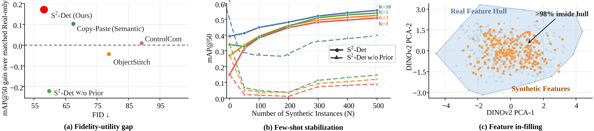
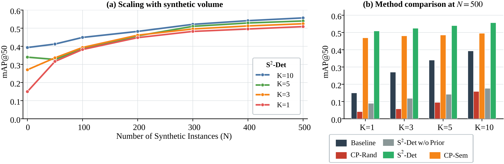
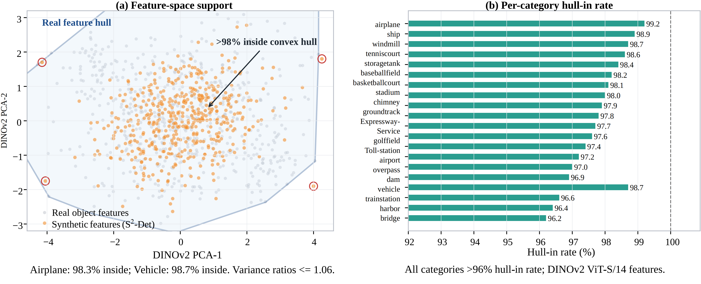
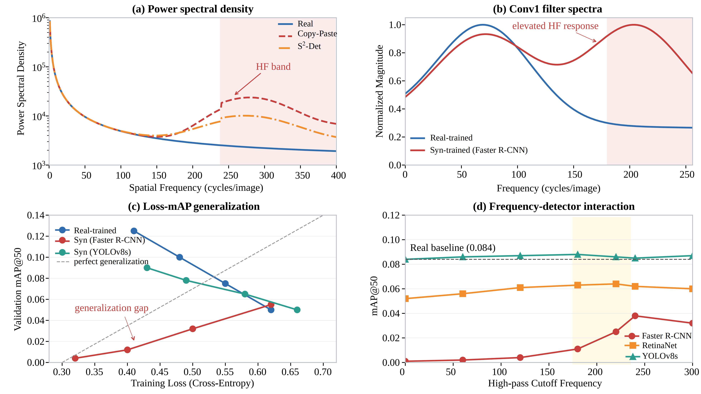

# S²-Det: Structure-Aware Synthesis for Low-Shot Object Detection in Remote Sensing

<p align="center">
  <strong>Anonymous Author(s)</strong><br>
  <strong>Anonymous Affiliation</strong><br><br>
  <a href="https://arxiv.org/abs/xxxx.xxxxx">
    
  </a>
  <a href="https://anonymous.github.io/s2det">
    
  </a>
  <a href="#license">
    
  </a>
</p>

<p align="center">
  <strong>NeurIPS 2026 Submission</strong>
</p>

<p align="center">
  
</p>

---

## Anonymous Release

This repository is anonymized for double-blind review. It releases the code needed to inspect and reproduce the structure-control synthesis pipeline used by S²-Det.

This repository does not redistribute DIOR, generated training sets, local experiment logs, or private training outputs. Large assets are intentionally hosted outside GitHub and should be downloaded separately.

## News

- **2026.05** Initial anonymous release of the S²-Det structure-control code.
- **2026.05** K-shot split schema, foreground manifest schema, and controlled-plan schema released.
- **Soon** Anonymous download links for S²-Det compositor weights and curated foreground bank.
- **Upon acceptance** Full non-anonymous model links, foreground bank, and detector checkpoints.

## Overview

S²-Det studies synthetic data as a controlled intervention for low-shot remote-sensing object detection. Instead of optimizing only for visual realism, we ask which structural conditions make synthetic supervision useful for detector learning.

The code builds on an AnyDoor-style object insertion backbone and adds a structure-aware control layer for remote-sensing detection. The released S²-Det controls are:

- **Semantic control:** sample target boxes from class-compatible semantic regions.
- **Density control:** control synthesized instance counts with the `--n` plan parameter.
- **Size control:** inherit target box sizes from selected K-shot instances with small perturbations.

<p align="center">
  
</p>

## Method at a Glance

| Stage | What is controlled | Released code |
|---|---|---|
| K-shot foreground extraction | supervision boundary and object identity | `strategy_control/scripts/extract_strict_foregrounds.py` |
| Structure-aware plan generation | semantic placement, instance density, object size | `strategy_control/scripts/generate_strict_semantic_plan.py` |
| AnyDoor-style composition | identity-preserving insertion and label inheritance | `strategy_control/scripts/render_strict_anydoor.py` |

<p align="center">
  
</p>

<p align="center">
  
</p>

## Main Findings

| Question | Observation |
|---|---|
| Does more realistic synthesis always help? | No. Perceptual fidelity is not a reliable proxy for detector utility. |
| What matters most in low-shot detection? | Structure: semantic placement, object size, and instance density dominate. |
| Is the effect detector-independent? | No. The same synthetic data can affect YOLO-style and Faster R-CNN-style detectors differently. |
| Why release control code? | The controls are the reproducible intervention variables behind the detector-facing audit. |

## What Makes S²-Det Different

S²-Det treats synthetic data as an intervention variable for detector learning. The release is organized around controllable factors rather than only around final generated images:

- data regime: low-shot K settings and synthetic instance count N
- placement structure: semantic-compatible vs random placement
- object geometry: K-shot size inheritance and perturbation
- rendering: AnyDoor-style object insertion
- supervision boundary: strict K-shot foregrounds vs full curated foreground bank
- detector-facing evaluation: downstream AP and failure diagnostics

This makes it possible to audit when synthetic supervision is useful, neutral, or harmful.

## Repository Layout

The intended public package contains the following top-level items:

```text
cldm/                  # ControlNet/latent-diffusion model components
configs/               # model, inference, and training configs
datasets/              # dataset loaders and preprocessing utilities
demo/                  # small demo inputs and examples
dinov2/                # DINOv2 encoder dependency used by the AnyDoor backbone
iseg/                  # mask refinement utilities
ldm/                   # latent diffusion modules
modules/               # S²-Det/AnyDoor extension modules
pretrain_clip/         # CLIP/DINO-related pretrained assets or download placeholders
pretrain_model/        # compositor checkpoint location or download placeholders
strategy_control/      # S²-Det semantic, density, and size control scripts
xformers/              # compatibility copy used by the backbone
out/                   # default generated output directory, ignored by git
cog.yaml
environment.yml
LICENSE
predict
requirements
run_inference
run_train
tool_add_control_sd21
```

`strategy_control/` is the S²-Det-specific part of the release. The other model directories are inherited from the AnyDoor-style compositor backbone and provide the renderer used to execute controlled plans.

## Installation

Create the environment:

```bash
conda env create -f environment.yml
conda activate anydoor
```

Install pip dependencies:

```bash
pip install -r requirements
```

Optional dataset/evaluation dependencies:

```bash
pip install pycocotools lvis
pip install git+https://github.com/cocodataset/panopticapi.git
```

## External Assets

GitHub is not suitable for hosting the dataset, pretrained weights, or foreground bank. Download the following assets separately and place them under the expected paths.

| Asset | Size | Required? | Put under | Download |
|---|---:|---|---|---|
| DIOR dataset | ~7.5 GB | yes | `${DIOR_ROOT}` | `https://gcheng-nwpu.github.io/` |
| DINOv2 ViT-g/14 weights | ~4 GB | yes | `pretrain_model/dinov2_vitg14_pretrain.pth` | `https://dl.fbaipublicfiles.com/dinov2/dinov2_vitg14/dinov2_vitg14_pretrain.pth` |
| AnyDoor base checkpoint (SD 2.1) | ~5 GB | yes | `pretrain_model/` | `https://github.com/ali-vilab/AnyDoor` |
| S²-Det compositor checkpoint | ~5 GB | yes for rendering | `pretrain_model/s2det_compositor.ckpt` | `[Anonymous Google Drive / Hugging Face link]` |
| Curated foreground bank | ~2 GB | optional, for full reproduction | `data/foreground_bank/` | `[Anonymous Google Drive / Hugging Face link]` |
| Released K-shot split metadata | <1 MB | recommended | `data/splits/` | included as templates; full metadata via `[anonymous split-metadata link]` |
| Detector checkpoints | ~50 MB | optional | `checkpoints/detectors/` | `[Anonymous Google Drive / Hugging Face link]` |

**Anonymous submission notes:**
- DINOv2 and AnyDoor links point to official public releases; no authorship information is exposed.
- DIOR links point to the official dataset page; authors are not involved in hosting.
- S²-Det compositor weights, foreground bank, and detector checkpoints are hosted on anonymous cloud storage during review.
- Replace `[Anonymous ...]` placeholders with actual anonymous links before submission.
- Google Drive and Hugging Face links must not reveal the real name or institutional affiliation of any author.

**Recommended local asset layout:**

```text
data/
  DIOR/
  foreground_bank/
  splits/
pretrain_model/
  dinov2_vitg14_pretrain.pth
  s2det_compositor.ckpt
pretrain_clip/
checkpoints/
  detectors/
```

Quick DINOv2 download:

```bash
mkdir -p pretrain_model
wget -O pretrain_model/dinov2_vitg14_pretrain.pth \
  https://dl.fbaipublicfiles.com/dinov2/dinov2_vitg14/dinov2_vitg14_pretrain.pth
```

## Checkpoint Configuration

Place compositor and encoder checkpoints under:

```text
pretrain_model/
pretrain_clip/
```

Update `configs/inference.yaml` so that:

```yaml
pretrained_model: pretrain_model/s2det_compositor.ckpt
config_file: configs/anydoor.yaml
save_memory: false
```

Do not leave local absolute paths in `configs/inference.yaml`.

## Data Preparation

Download DIOR from the official source or your licensed mirror and arrange it locally:

```text
${DIOR_ROOT}/Annotations/
${DIOR_ROOT}/JPEGImages/
${DIOR_ROOT}/ImageSets/Main/train.txt
${DIOR_ROOT}/DIOR_dataset/images/train/
${DIOR_ROOT}/DIOR_dataset/labels/train/
${DIOR_ROOT}/DIOR_dataset/images/test/
${DIOR_ROOT}/DIOR_semantic_masks/
```

Set:

```bash
export DIOR_ROOT=/path/to/DIOR
```

Semantic masks should be NumPy arrays named by image id:

```text
${DIOR_ROOT}/DIOR_semantic_masks/000001.npy
```

If semantic masks are not available, generate them with your preferred land-cover/semantic segmentation model and convert them to the integer label IDs expected by `strategy_control/scripts/generate_strict_semantic_plan.py`. The class-to-semantic compatibility map is defined in that script as `COMPATIBILITY`.

## Foreground Bank

S²-Det can run in two modes:

- strict K-shot mode: foregrounds are cropped only from selected K-shot instances using `extract_strict_foregrounds.py`
- full reproduction mode: use the curated foreground bank released separately

For strict K-shot reproduction, no external foreground bank is required:

```bash
python strategy_control/scripts/extract_strict_foregrounds.py \
  --dior-root "$DIOR_ROOT" \
  --split-json out/splits/k3/k3_selected_instances.json \
  --out-dir out/foregrounds/k3
```

For full-paper reproduction, download the curated foreground bank and set:

```bash
export FG_BANK_ROOT=/path/to/foreground_bank
```

Then pass the corresponding manifest to the plan generator with `--fg-manifest`.

## Structure-Control Synthesis

### 1. Generate a K-shot split

```bash
python strategy_control/scripts/generate_fixed_kshot_split.py \
  --dior-root "$DIOR_ROOT" \
  --k 3 \
  --seed 42 \
  --out-dir out/splits/k3
```

Outputs:

```text
out/splits/k3/k3_selected_instances.json
out/splits/k3/k3_train_image_ids.txt
out/splits/k3/k3_train_images.txt
out/splits/k3/k3_split_summary.json
```

### 2. Extract K-shot foregrounds

```bash
python strategy_control/scripts/extract_strict_foregrounds.py \
  --dior-root "$DIOR_ROOT" \
  --split-json out/splits/k3/k3_selected_instances.json \
  --out-dir out/foregrounds/k3
```

This writes:

```text
out/foregrounds/k3/manifest.json
```

### 3. Generate a semantic/density/size controlled plan

```bash
python strategy_control/scripts/generate_strict_semantic_plan.py \
  --dior-root "$DIOR_ROOT" \
  --split-json out/splits/k3/k3_selected_instances.json \
  --fg-manifest out/foregrounds/k3/manifest.json \
  --exclude-image-ids out/splits/k3/k3_train_image_ids.txt \
  --n 200 \
  --seed 42 \
  --out-plan out/plans/strict_k3_n200_semantic.json
```

Plan entries follow this schema:

```json
{
  "class": "airplane",
  "foreground_path": "out/foregrounds/k3/airplane/000123_obj0_0.png",
  "background_path": "${DIOR_ROOT}/DIOR_dataset/images/train/000456.jpg",
  "bg_id": "000456",
  "x": 120,
  "y": 240,
  "w": 80,
  "h": 70
}
```

### 4. Render the controlled plan

The renderer imports the AnyDoor-style compositor and calls `demo_20251117.py::inference_single_image`.

```bash
export ANYDOOR_ROOT=/path/to/this/repository

python strategy_control/scripts/render_strict_anydoor.py \
  --anydoor-root "$ANYDOOR_ROOT" \
  --plan out/plans/strict_k3_n200_semantic.json \
  --output-dir out/rendered/images/train \
  --label-dir out/rendered/labels/train
```

### 5. Build a detector YAML

```bash
python strategy_control/scripts/build_yolo_yaml_from_list.py \
  --root-path "$DIOR_ROOT" \
  --train-list out/train_lists/k3_n200.txt \
  --out-yaml out/yamls/k3_n200.yaml
```

Detector training is intentionally separated from this repository. Use your detector framework with the generated image/label folders and YAML.

## Compositor Inference

For single-image or batch object insertion without the S²-Det plan generator, use the released inference wrapper.

Expected input folders for batch mode:

```text
demo/input/bg/
demo/input/fg/
demo/input/mask/
```

Example:

```bash
./run_inference \
  --mode 2 \
  --bg_dir demo/input/bg \
  --fg_dir demo/input/fg \
  --mask_dir demo/input/mask \
  --save_dir out/demo_batch
```

If using the Python script directly:

```bash
python demo_20251117.py \
  --mode 2 \
  --bg_dir demo/input/bg \
  --fg_dir demo/input/fg \
  --mask_dir demo/input/mask \
  --save_dir out/demo_batch
```

`predict` provides the Cog/Replicate-style single-example interface. It expects:

- reference image
- reference mask
- target/background image
- target mask

## Compositor Training

The training wrapper corresponds to the AnyDoor-style compositor fine-tuning code.

```bash
./run_train --config configs/anydoor.yaml
```

If using the Python script directly:

```bash
python run_train_anydoor.py
```

Before training, edit the dataset section in `configs/my_datasets.yaml` and checkpoint path in the training script/config to point to your local data and checkpoint.

## Results Snapshot

S²-Det is evaluated as a detector-facing intervention: the same synthesis pipeline is audited under different K-shot regimes, structural controls, and detector backbones.

<p align="center">
  
</p>

<p align="center">
  
</p>

<p align="center">
  
</p>

## Qualitative Results

<p align="center">
  
</p>

<p align="center">
  
</p>

Optional project video:

```html
<!--
<p align="center">
  <video src="assets/demo.mp4" width="95%" controls></video>
</p>
-->
```

## Reproducibility Notes

- `out/` is the default output directory and should be ignored by git.
- `strategy_control/examples/` contains schemas/templates only.
- DIOR data and large checkpoints are external dependencies.
- For anonymous review, keep author names, machine paths, and private logs out of configs and docs.

## Citation

```bibtex
@inproceedings{anonymous2026s2det,
  title     = {S2-Det: Structure-Aware Synthesis for Low-Shot Object Detection in Remote Sensing},
  author    = {Anonymous Author(s)},
  booktitle = {NeurIPS},
  year      = {2026}
}
```

## License

See `LICENSE`. Third-party components retain their original licenses. DIOR and pretrained checkpoints are not redistributed in this repository.
